<div align="center">
  <picture>
    <source media="(prefers-color-scheme: dark)" srcset="./assets/hero.svg">
    <source media="(prefers-color-scheme: light)" srcset="./assets/hero-light.svg">
    
  </picture>
</div>

<div align="center">
  <sub><!-- LAST_SHIPPED:START -->last shipped — initializing<!-- LAST_SHIPPED:END --></sub>
</div>

<br />

## hey

I build on the web — interfaces, small tools, and the occasional experiment that grows legs.

Most of what I make lives somewhere between *useful* and *unnecessary*, which is exactly where I like it.

<br />

## currently

```text
→ shipping small, often
→ caring about motion, defaults, and the feel of things
→ [edit me — whatever you're cooking right now]
```

<br />

## stack

```text
languages   typescript · python
frontend    react · next · tailwind · framer motion
backend     node · postgres · sqlite
tools       vscode · figma · vercel · claude code
```

<br />

## stats

<div align="center">
  
  
</div>

<br />

## connect

```text
github      @thiscube
[edit me]   [your link]
```

<br />

<div align="center">
  <sub>built with care · last updated may 2026</sub>
</div>
